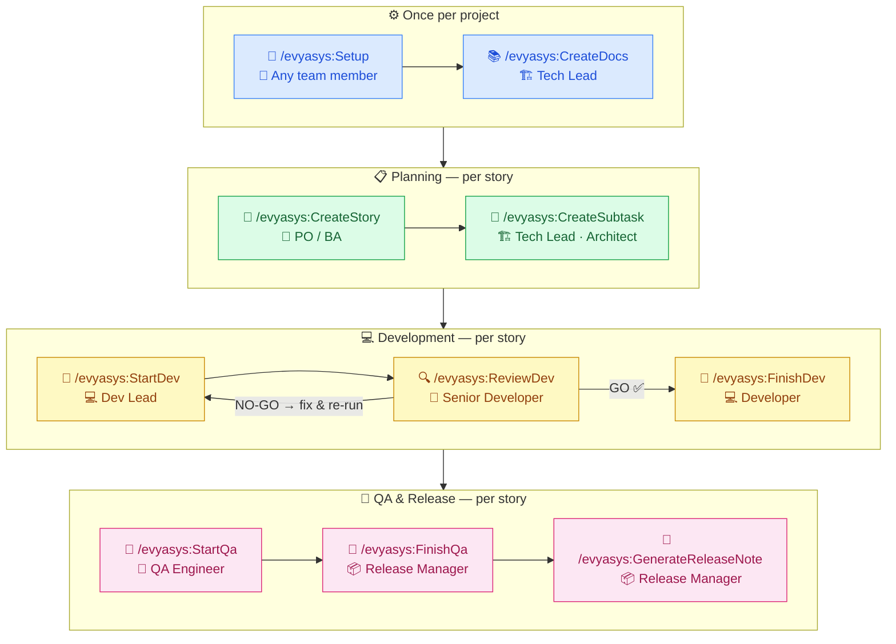

# Evyasys — Quick-Start Guide

> **One-page reference for new team members.**
> Full details are in `README.md`. This card gets you running in under 10 minutes.

---

## Step 0 — Install Claude Code (if not already installed)

Evyasys is a plugin for **Claude Code** — Anthropic's AI coding agent. You need it first.

```bash
npm install -g @anthropic-ai/claude-code
```

Verify:
```bash
claude --version
```

Launch from inside your project folder:
```bash
cd your-project
claude
```

> Requires Node.js 18+. Get it at [nodejs.org](https://nodejs.org/)  
> Claude Code docs: [docs.anthropic.com/claude-code](https://docs.anthropic.com/en/docs/claude-code/getting-started)

---

## Step 1 — Install the Evyasys plugin (once per machine)

**Inside Claude Code**, run each command individually — copy and paste one at a time:

**1 of 3 — Register the plugin source**
```
/plugin marketplace add https://github.com/Evyasys-Software-Solutions/EvyaGovernance.git
```

**2 of 3 — Install the plugin**
```
/plugin install evyasys@EvyaGovernance
```

**3 of 3 — Reload so the commands appear**
```
/reload-plugins
```

> ⚠️ Run them in order. Wait for each to complete before running the next.

Type `/evya` — you should see 10 commands in autocomplete.

---

## Step 2 — Configure your project (once per project, first user)

**Inside Claude Code** from your project root:

```
/evyasys:Setup
```

The wizard asks you to pick:
- **PM Tool:** Local folder only / Azure DevOps / JIRA / GitHub Projects
- **Notification Tool:** None / Teams / Slack / WhatsApp / Email

Then collects and **validates credentials live** for your chosen tools — you'll see a confirmation before anything is saved. Non-sensitive settings are saved to `.evyasys/project.yaml` (commit this). Personal secrets are encrypted to `~/.evyasys/credentials` (never committed).

**Teammates:** just `git pull` to get the project config, then run `/evyasys:Setup` to enter their own credentials.

---

## Step 3 — Copy the project template (if .evyasys/ doesn't exist yet)

```bash
# macOS / Linux
evyasys=$(ls -td ~/.claude/plugins/cache/EvyaGovernance/evyasys/*/ | head -1)
cp -r "${evyasys}project-template/.evyasys" ./.evyasys
```

```powershell
# Windows
$evyasys = (Get-Item "$env:USERPROFILE\.claude\plugins\cache\EvyaGovernance\evyasys\*" | Sort-Object LastWriteTime -Descending | Select-Object -First 1).FullName
Copy-Item -Recurse "$evyasys\project-template\.evyasys" ".\.evyasys"
```

Then run `/evyasys:Setup` — it will fill in `.evyasys/project.yaml` for you.

Commit so the whole team shares the config:

```bash
git add .evyasys/project.yaml
git commit -m "Add Evyasys config"
git push
```

---

## Step 4 — Generate project quality-gate docs (once per project)

```
/evyasys:CreateDocs
```

Scans your codebase and writes 19 quality-gate documents to `.evyasys/docs/`.
Every downstream command loads these docs before forming any technical opinion.
Re-run with `--retrain` after major architecture changes.

---

## The 10 commands — full delivery pipeline

Open Claude Code from **inside your project folder**, then:



| Command | Who | PM State After | Notification |
|---|---|---|---|
| `/evyasys:Setup` | 👤 Any team member | — | — |
| `/evyasys:CreateDocs` | 🏗️ Tech Lead | — | — |
| `/evyasys:CreateStory` | 👔 PO / BA | Epics + Backlog | 📂 Epics · 📋 Stories |
| `/evyasys:CreateSubtask EVYA-1042` | 🏗️ Architect | Tasks created | 📝 Subtasks Ready |
| `/evyasys:StartDev EVYA-1042` | 💻 Dev Lead | **In Progress** | 🚀 Dev Started |
| `/evyasys:ReviewDev EVYA-1042` | 🎯 Senior Dev | — (GO or NO-GO) | ✅ Passed or ❌ NO-GO |
| `/evyasys:FinishDev EVYA-1042` | 💻 Developer | **Ready for QA** | 🔀 Ready for QA |
| `/evyasys:StartQa EVYA-1042` | 🔬 QA Engineer | **In QA** | 🧪 QA Started |
| `/evyasys:FinishQa EVYA-1042` | 📦 Release Manager | **Done** ✅ | 🚢 Released |
| `/evyasys:GenerateReleaseNote EVYA-1042 EVYA-1043` | 📦 Release Manager | — | 📄 Release Notes |

**Nothing touches your PM tool or notification channel until you explicitly approve.**

---

## PDF setup (for GenerateReleaseNote)

```bash
npm install pdfkit
```

Configure branding in `.evyasys/project.yaml` under `release_notes:` — or let `/evyasys:Setup` ask you:

| Setting | What it controls | Default |
|---|---|---|
| `company_name` | PDF header + footer text | project name |
| `logo_path` | Company logo on cover page (PNG/JPEG) | none |
| `brand_color` | Header/cover band color (hex) | `#0078d4` |
| `output_dir` | Where PDFs are saved | `.evyasys/releases/` |
| `naming_convention` | `v{version}` / `Sprint-{N}` / `{date}` | `v{version}` |

PDFs are saved to `.evyasys/releases/` and release history is tracked in `.evyasys/memory/release-notes.json`.

---

## Supported PM Tools

| Tool | What syncs |
|---|---|
| `local` | Nothing external — artefacts in `.evyasys/board/` only |
| `devops` | Azure DevOps — Epics, User Stories, Tasks, state transitions |
| `jira` | JIRA Cloud — Epics, Stories, Sub-tasks, issue transitions |
| `github` | GitHub Issues + Projects v2 — issues, labels, board cards |

## Supported Notification Tools

| Tool | How |
|---|---|
| `none` | Not needed — no notifications |
| `teams` | Adaptive Card posted to a Teams channel via Power Automate HTTP workflow |
| `slack` | Incoming webhook message to a Slack channel |
| `whatsapp` | Twilio API WhatsApp message |
| `email` | HTML email via SMTP — Gmail, Outlook, SendGrid, or any SMTP server |

---

## Output files (all in your project repo)

```
.evyasys/
├── docs/                                    ← CreateDocs (quality-gate documents)
│   ├── INDEX.md
│   ├── ARCHITECTURE.md
│   └── ... (19 documents)
└── board/
    └── epics/
        └── EP-001/
            ├── EP-001_Epic.md                        ← CreateStory (new epics only)
            └── stories/
                └── EVYA-1042/
                    ├── EVYA-1042_UserStory.md        ← CreateStory
                    ├── EVYA-1042_TechBrainstorm.md   ← StartDev
                    ├── EVYA-1042_CodeReview.md       ← ReviewDev (GO + NO-GO)
                    ├── EVYA-1042_DevSummary.md       ← FinishDev
                    ├── EVYA-1042_TestPlan.md         ← StartQa
                    ├── EVYA-1042_ReleaseNotes.md     ← FinishQa
                    └── subtasks/
                        └── EVYA-1042_Subtasks.md     ← CreateSubtask
releases/
    └── Release_v1.2.0_2026-05-21.md   ← GenerateReleaseNote (markdown)
    └── Release_v1.2.0_2026-05-21.pdf  ← GenerateReleaseNote (PDF)
```

Stories without an Epic are saved at `.evyasys/board/stories/<id>/`.

---

## Dry-run mode — preview without side effects

```bash
# macOS / Linux
EVYASYS_DRY_RUN=1 /evyasys:CreateStory
```

```powershell
# Windows PowerShell
$env:EVYASYS_DRY_RUN = "1"
/evyasys:StartDev EVYA-1042
```

---

## Update or fix the plugin

```powershell
# Windows — clear cache and reinstall
Remove-Item -Recurse -Force "$env:USERPROFILE\.claude\plugins\marketplaces" -ErrorAction SilentlyContinue
Remove-Item -Recurse -Force "$env:USERPROFILE\.claude\plugins\evyasys" -ErrorAction SilentlyContinue
```

```bash
# macOS / Linux
rm -rf ~/.claude/plugins/marketplaces ~/.claude/plugins/evyasys
```

Then repeat Step 1 (install the plugin again).

---

## Troubleshooting

| Symptom | Fix |
|---|---|
| `claude` command not found | Install Node.js 18+ then `npm install -g @anthropic-ai/claude-code` |
| Commands don't appear after `/reload-plugins` | Clear cache (see Update section above) and reinstall |
| No PM tool configured | Run `/evyasys:Setup` |
| Credentials not found / 401 error | Credentials expired — run `/evyasys:Setup` and re-enter |
| Webhook missing | Run `/evyasys:Setup` to update the webhook URL |
| Wrong project loaded | Open Claude Code from inside the correct project folder |

---

## Where things live

| Location | What | In git? |
|---|---|---|
| `~/.claude/plugins/cache/EvyaGovernance/` | Plugin (auto-installed) | ✅ EvyaGovernance repo |
| `<project>/.evyasys/project.yaml` | PM tool + notification tool config | ✅ project repo |
| `<project>/.evyasys/docs/` | Quality-gate documents (19 files) | ✅ project repo |
| `<project>/.evyasys/board/` | All story artefacts | ✅ project repo |
| `~/.evyasys/credentials` | Your personal credentials (encrypted) | ❌ never committed |
