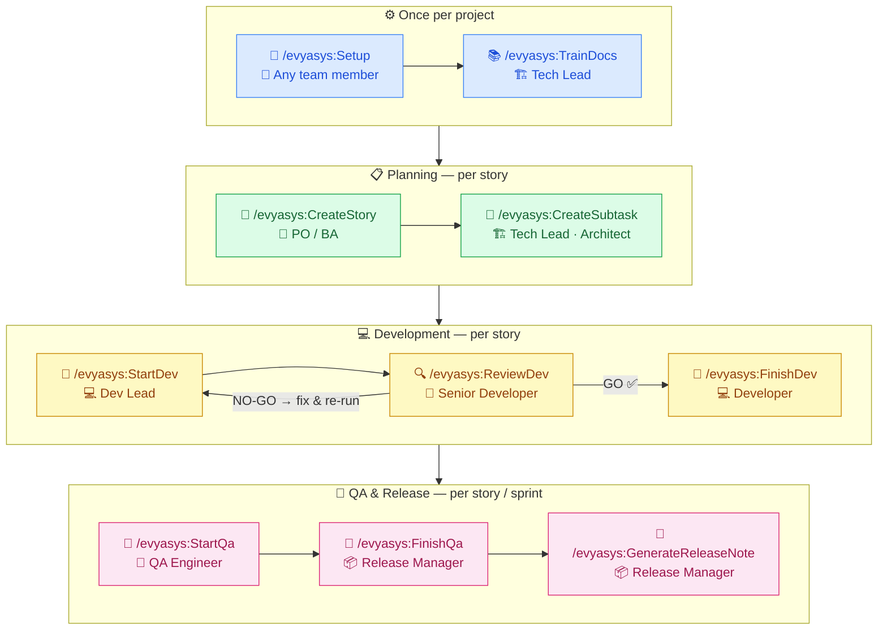

# Evyasys

Evyasys is a complete AI-assisted delivery pipeline for software teams — project quality
docs, business story, task breakdown, technical brainstorm, code review, dev sign-off,
QA, and release — driven by eight slash commands inside your AI coding agent.

Built on structured engineering principles: brainstorming before any code is written,
independent evidence-based code review, hard confirmation gates at every stage, and
humans approving before anything touches your PM tool or notification channel.

---

## Installation

Three levels of setup: **Claude Code** (the AI agent), **machine-level** (once per
developer), and **project-level** (once per repo — teammates get it via `git pull`).

---

### Step 0 — Install Claude Code (prerequisite)

Evyasys runs as a plugin inside **Claude Code** — Anthropic's AI coding agent.
Install it first if you haven't already.

**macOS / Linux**
```bash
npm install -g @anthropic-ai/claude-code
```

**Windows (PowerShell)**
```powershell
npm install -g @anthropic-ai/claude-code
```

Verify:
```bash
claude --version
```

Launch from inside your project:
```bash
# macOS / Linux
cd your-project && claude

# Windows
cd your-project; claude
```

> Requires **Node.js 18+** — download from [nodejs.org](https://nodejs.org/) if needed.  
> Full Claude Code docs: [docs.anthropic.com/claude-code](https://docs.anthropic.com/en/docs/claude-code/getting-started)

---

### Step 1 — Install Evyasys plugin (once per machine)

Open Claude Code and run these two commands — one at a time:

```
/plugin marketplace add https://github.com/Evyasys-Software-Solutions/EvyaGovernance.git
```
```
/plugin install evyasys@EvyaGovernance
```

When prompted, choose **Install for you (user scope)** so it works in every project.

Then **fully quit Claude Code and reopen it** — commands appear after a fresh start.

Type `/evya` — you should see 12 commands in autocomplete.

---

### Step 2 — Configure the project (once per project, first user)

**Inside Claude Code** from your project's root folder, run:

```
/evyasys:Setup
```

The wizard starts by **confirming you're in the right project folder**, then guides you through:
1. **PM Tool** — Local folder only / Azure DevOps / JIRA / GitHub Projects
2. **Notification Tool** — None / Teams / Slack / WhatsApp / Email

Setup **automatically creates `.evyasys/`** in the current folder if it doesn't exist — no manual template copy needed. Credentials are **validated live** before saving. Non-sensitive settings (org names, project keys, webhook URLs) are saved to `.evyasys/project.yaml` and committed so the whole team inherits them via `git pull`. Sensitive credentials (PAT, API tokens, Twilio auth) are saved **encrypted** to `~/.evyasys/credentials` — never committed.

**Subsequent team members** only need to run `/evyasys:Setup` to enter their own credentials (the project config is already committed). On Azure DevOps they can also use the legacy scripts:

```bash
# macOS / Linux (Azure DevOps only)
bash ~/.claude/plugins/marketplaces/EvyaGovernance/scripts/login.sh
```

```powershell
# Windows (Azure DevOps only)
powershell -ExecutionPolicy Bypass -File "$env:USERPROFILE\.claude\plugins\marketplaces\EvyaGovernance\scripts\login.ps1"
```

---

Teammates just `git pull` — they only need to run `/evyasys:Setup` once to enter their own personal credentials.

**What `/evyasys:Setup` writes to `.evyasys/project.yaml`** (reference — the wizard fills this for you):

```yaml
# Display name shown in notification cards
name: "Customer Portal"

# PM tool: local | devops | jira | github
pm_tool: "devops"

# Azure DevOps (if pm_tool is "devops")
azure_devops:
  org: "YourAzureOrg"
  project: "YourAzureProject"

# Notification tool: none | teams | slack | whatsapp | email
notification_tool: "teams"

# Teams webhook — HTTP trigger URL from your Power Automate workflow
teams:
  webhook: "https://<env>.environment.api.powerplatform.com/powerautomate/..."
```

Commit the config so every teammate gets it automatically:

```bash
git add .evyasys/project.yaml
git commit -m "Add Evyasys config"
git push
```

**Notifications your channel receives (Teams, Slack, WhatsApp, or Email):**

| Event | Message |
|---|---|
| Epics created (batch) | 📂 Epics Ready — table of all epics with New/Existing status and PM IDs |
| Stories created (batch) | 📋 Stories Ready — table of all stories with Epic, SP, PM ID, and sync status |
| Subtasks created | 🗂️ Subtasks Ready |
| Dev started | 🚀 Dev Started |
| Code review passed | ✅ Code Review Passed |
| Code review NO-GO | ❌ Code Review NO-GO |
| Dev handed to QA | 🔀 Ready for QA |
| QA test plan ready | 🧪 QA Started |
| Bugs found in QA | 🐛 Bugs Found (P1/P2 keeps story In QA) |
| Story released | 🚢 Released |

All notifications fire **after your approval**. Both GO and NO-GO reviews notify the team.

---

### Updating to the latest version

**Step 1 — Run the update (inside Claude Code):**

```
/evyasys:Update
```

Confirm when prompted. The update command checks your installed version against the latest on GitHub, shows what's new from the changelog, then shows you the commands to complete the update.

Your `.evyasys/` docs, board artefacts, `project.yaml`, and credentials are **never touched**.

**Steps 2–4 — Run these commands in order, inside Claude Code:**

```
/plugin marketplace update EvyaGovernance
```
```
/plugin update evyasys@EvyaGovernance
```
```
/reload-plugins
```

**Step 5 — Fully quit Claude Code and reopen it.**

All commands appear at the new version. Project config and credentials unchanged.

---

### Repairing a broken install

If commands are missing or broken and `/evyasys:Update` doesn't fix it, run the repair command:

```
/evyasys:Repair
```

Confirm when prompted. Repair does a full clean reinstall — clears the plugin cache, removes the old install entry from settings, then shows you the commands to reinstall from scratch.

**After Repair, run these commands in order, inside Claude Code:**

```
/reload-plugins
```
```
/plugin marketplace add https://github.com/Evyasys-Software-Solutions/EvyaGovernance.git
```
```
/plugin install evyasys@EvyaGovernance
```

When prompted, choose **Install for you (user scope)**, then **fully quit Claude Code and reopen it**.

Your `.evyasys/` docs, board artefacts, `project.yaml`, and credentials are **never touched** by either command — only plugin code is removed and reinstalled.

---

### Troubleshooting

| Symptom | Fix |
|---|---|
| `claude` command not found | Install Node.js 18+ then `npm install -g @anthropic-ai/claude-code` |
| Commands don't appear after update | Run `/evyasys:Repair` and follow the reinstall steps it shows |
| Commands don't appear after fresh install | Fully quit and reopen Claude Code, then try `/reload-plugins` |
| Setup wizard skips steps (e.g. compression not asked) | A stale `.ai/` folder in your project is shadowing the plugin. Delete it: `rm -rf .ai` (macOS/Linux) or `Remove-Item -Recurse .ai` (Windows PowerShell), then run `/evyasys:Setup` again. |
| No PM tool configured | Run `/evyasys:Setup` |
| Credentials not found | Run `/evyasys:Setup` to re-enter encrypted credentials |
| 401 / auth error | Credentials expired — run `/evyasys:Setup` and re-enter |
| Webhook missing | Run `/evyasys:Setup` to update the webhook URL |
| Missing ADO org/project | Run `/evyasys:Setup` or edit `.evyasys/project.yaml` |
| Wrong project loaded | Open Claude Code from inside the correct project folder |

---

## The 10 Commands

Type `/evya` in Claude Code to see all commands in autocomplete.

Nothing touches your PM tool or notification channel until you **explicitly approve**.

---

### Team Roles & Pipeline



### Command Reference

| # | Phase | Command | Role | What the Agent Does | Output | PM State |
|---|-------|---------|------|---------------------|--------|----------|
| 1 | Setup | `/evyasys:Setup` | 👤 Any | Choose PM + notification tool; collect + encrypt credentials | `project.yaml` · `credentials` | — |
| 2 | Setup | `/evyasys:TrainDocs` | 🏗️ Tech Lead | Scan full codebase; generate 37 quality-gate docs | `.evyasys/docs/` (37 files) | — |
| 3 | Plan | `/evyasys:CreateStory` | 👔 PO / BA | Resolves/creates epics (Gate 1); plans full story batch (Gate 2); drafts all stories; syncs everything; 2 notifications | `{epicId}_Epic.md` · `{storyId}_UserStory.md` | Epics + Backlog |
| 4 | Plan | `/evyasys:CreateSubtask EVYA-XXXX EVYA-XXYY` | 🏗️ Architect | Load shared context once; cross-story analysis; single consolidated plan approval; 3–7 dev tasks + QA task per story; 1 batch notification | `{storyId}_Subtasks.md` (per story) | Tasks created |
| 5 | Dev | `/evyasys:StartDev EVYA-XXXX [EVYA-XXYY] [EP-00N]` | 💻 Dev Lead | Accepts one story, multiple stories, an epic, or a mix; epic IDs auto-expand to stories; brainstorm 3+ approaches per story; architecture approval gate | `TechBrainstorm.md` (per story) | **In Progress** |
| 6 | Dev | `/evyasys:ReviewDev EVYA-XXXX` | 🎯 Senior Dev | Independent review: full diff, AC coverage, arch, security, test quality — GO / NO-GO | `CodeReview.md` | — |
| 7 | Dev | `/evyasys:FinishDev EVYA-XXXX` | 💻 Developer | AC audit; diff scope check; DoD checklist; architect gate (docs-to-update list) | `DevSummary.md` | **Ready for QA** |
| 8 | QA | `/evyasys:StartQa EVYA-XXXX` | 🔬 QA Engineer | Load domain quality gates; ask env + test data; write AC-driven test cases (Gherkin) | `TestPlan.md` | **In QA** |
| 9 | QA | `/evyasys:FinishQa EVYA-XXXX` | 📦 Release Mgr | Record TC outcomes; Security/Perf/A11y/DB exit gates; draft release notes | `ReleaseNotes.md` | **Done** ✅ |
| 10 | Release | `/evyasys:GenerateReleaseNote EVYA-1042 EVYA-1043` | 📦 Release Mgr | Aggregate stories by Epic; consolidate quality gates; propose version; generate branded PDF | `releases/*.pdf` | — |

> Every state transition and every notification fires **only after your approval**. Both GO and NO-GO review results are always saved to disk.

---

### `/evyasys:Setup`
**Who:** First user on a new project — **When:** Before any other command

Interactive wizard that configures Evyasys for this project. Run once per project; teammates only need to enter their own credentials (pulled from the committed `project.yaml`).

**Supported PM Tools:**

| Tool | What syncs |
|---|---|
| `local` | Nothing external — all artefacts stay in `.evyasys/board/` only |
| `devops` | Azure DevOps — Epics, User Stories, Tasks with hierarchy links + state transitions |
| `jira` | JIRA Cloud — Epics, Stories, Sub-tasks with parent links + issue transitions |
| `github` | GitHub Issues + Projects v2 — issues, labels, board cards |

**Supported Notification Tools:**

| Tool | How |
|---|---|
| `none` | Not needed — no notifications sent |
| `teams` | Adaptive Card posted to a Teams channel via Power Automate HTTP workflow |
| `slack` | Incoming webhook message to a Slack channel |
| `whatsapp` | Twilio API WhatsApp message |
| `email` | HTML email via SMTP (Gmail, Outlook, SendGrid, or any SMTP server) |

**Saves to:** `.evyasys/project.yaml` (non-sensitive, committed) · `~/.evyasys/credentials` (secrets, encrypted, never committed)

---

### `/evyasys:TrainDocs`
**Who:** Tech Lead — **When:** First time on a new project, then `--retrain` after major changes

Scans the entire codebase — tech stack, source structure, architecture layers, CI/CD,
tooling config, design system tokens, UI/UX patterns, code sampling — and generates **37 quality-gate documents** into
`.evyasys/docs/`. These documents are automatically loaded by every downstream command
before forming any technical opinion: StartDev loads them before brainstorming,
ReviewDev checks the diff against them, FinishDev verifies compliance before sign-off,
StartQA uses them to set pass/fail criteria.

**Arguments:**
- _(no args)_ — Full scan and generate all 35 documents
- `--update` — Regenerate all documents, preserving project customisations
- `--update FILENAME.md` — Regenerate a single document
- `--retrain` — Detect which files changed since last run (via `git log`) and regenerate only affected documents. Use after stack upgrades, schema changes, design system token updates, or component library changes.

| Document | Purpose |
|---|---|
| `ARCHITECTURE.md` | System layers, component map, data flow, anti-patterns |
| `RULES.md` | Non-negotiable coding rules — violations block merge |
| `STANDARDS.md` | Naming, formatting, file organisation |
| `PATTERNS.md` | Approved design patterns with canonical examples |
| `SECURITY.md` | Auth model, input validation, secrets, OWASP requirements |
| `TESTING.md` | Test strategy, coverage requirements, naming, mocking |
| `PERFORMANCE.md` | Response time budgets, hot paths, caching, anti-patterns |
| `DB_STANDARDS.md` | Schema conventions, migrations, query patterns, indexes |
| `API_STANDARDS.md` | Endpoint conventions, request/response format, error codes |
| `FRONTEND.md` | Component structure, state, routing, accessibility |
| `DESIGN_SYSTEM.md` | UI tokens, component library, typography, colour, breakpoints |
| `UI_UX_STANDARDS.md` | Loading/error/empty states, forms, toast patterns, accessibility baseline |
| `fe/STYLING_MICRO_STANDARDS.md` | Complete token catalogue, icon size matrix, spacing anatomy, CSS architecture rules |
| `fe/HOOKS_DEEP_RULES.md` | 8-rule hook contract, useEffect rules, memoization decision trees, banned anti-patterns |
| `fe/DEPENDENCIES_WORKFLOW.md` | Approved libraries, new-dep checklist, bundle limits, feature workflow, review contract |
| `fe/ACCESSIBILITY.md` | WCAG 2.1 AA compliance contract — contrast ratios, keyboard nav, ARIA patterns, focus management, touch targets |
| `fe/VISUAL_QUALITY.md` | Interactive state contract (hover/focus/disabled/loading/error/empty per component type), motion standards, responsive gates |
| `UNIT_TESTING_COMPLETE.md` | Coverage requirements, FE + BE test patterns, factories, MSW, naming rules |
| `be/MICRO_STANDARDS_BE.md` | Controller/Service/Repository micro-contracts, error flow, logging rules |
| + 8 more | STACK, BACKEND, WORKFLOWS, DEPLOYMENT, ERROR_HANDLING, DECISIONS, ONBOARDING, GLOSSARY |

**Produces:** 35 `.md` files + `INDEX.md` → `.evyasys/docs/` (micro docs in `fe/` and `be/` subdirectories)

---

### `/evyasys:CreateStory`
**Who:** BA / Product Owner — **When:** Start of every feature

**One command creates everything** — Epics AND Stories in a single run.

Requirements can be provided inline (describe here) or via a reference document. Reference
documents are analysed from four perspectives (BA, Architect, Quality, Scope Decomposition)
before structured Q&A fills the gaps. The analysis and Q&A are archived to
`.evyasys/board/referencedoc/{date}/` for permanent team traceability.

**Two gates keep the team in control:**
- **Gate 1** — confirms new epics (ID, title, goal) before anything is created. If all epics already exist, this gate is skipped.
- **Gate 2** — approves the full story plan table (ID, Epic, SP, key ACs) in one go. User can remove, rename, or adjust before drafting begins.

Each story is drafted in pure business language, self-reviewed against the DoR checklist,
and cross-checked for Impacted Areas consistency across the batch. Stories are saved locally
first (always safe), then synced to the PM tool.

**Notifications (exactly 2):**
1. 📂 Epics table — all epics with New/Existing status and PM IDs
2. 📋 Stories table — all stories with Epic, SP, PM ID, and sync status; failures highlighted when they occur

**Produces:** `{epicId}_Epic.md` (new epics) · `{storyId}_UserStory.md` (all stories) · PM work items · 2 notifications

---

### `/evyasys:CreateSubtask EVYA-1042 EVYA-1043`
**Who:** Tech Lead / Architect — **When:** After stories are approved, before any development begins

Accepts one or more story IDs and/or epic IDs in a single call. Processes the entire
batch with a **load-once** architecture — quality-gate docs and source files are read
once for the whole batch, not once per story. Token usage scales with unique files,
not with story count.

**Input forms:**
```
/evyasys:CreateSubtask EVYA-1042                  ← single story
/evyasys:CreateSubtask EVYA-1042 EVYA-1043        ← multiple stories
/evyasys:CreateSubtask EP-001                     ← all stories in an epic
/evyasys:CreateSubtask EP-001 EVYA-1005           ← epic + additional story
```

**Three-phase flow:**

*Phase 1 — Shared context (once):* Resolves all story/epic IDs, reads every story file,
loads quality-gate docs based on the **union** of all Impacted Areas across all stories
(or derives standards from the codebase if no docs exist), runs a unified code analysis
reading each impacted file exactly once, then performs a **cross-story dependency analysis**
identifying shared files, shared infrastructure tasks, development sequence, parallelisable
stories, and merge-conflict risk.

*Phase 2 — Planning:* Asks batch-level clarifying questions only, selects the best strategy
per story, then presents a **single consolidated approval table** covering all stories with
cross-story notes and recommended sequence. No task is written before you confirm.

*Phase 3 — Draft:* Writes 3–7 implementation tasks + 1 mandatory QA task per story using
only the shared context — no additional file reads. Shared tasks (e.g. a DB migration
needed by multiple stories) are written in full once in the owning story and referenced
in others. Every task has a functional headline and a full Technical Analysis with exact
file paths, method signatures, DB changes, API contract, edge cases, security rules,
and performance decisions.

| Strategy | Description | Best when |
|---|---|---|
| **A — Backend-first + Frontend** *(recommended)* | Data/service/API layer first; UI after | Most stories |
| **B — Vertical slices** | Each task delivers one complete AC end-to-end | Truly independent ACs |
| **C — Layer by layer** | All data → all service → all UI | Large cross-cutting refactors |

**Produces:** `{storyId}_Subtasks.md` per story · `tests/e2e/{storyId}.spec.ts` (Playwright scaffold) · PM child tasks linked to parent story · 📝 1 batch notification

---

### `/evyasys:StartDev EVYA-1042 [EVYA-1043] [EP-001]`
**Who:** Engineering Lead — **When:** Sprint start, before any code is written

**Input forms:**
```
/evyasys:StartDev EVYA-1042                    ← single story
/evyasys:StartDev EVYA-1042 EVYA-1043          ← multiple stories
/evyasys:StartDev EP-001                       ← all stories in an epic
/evyasys:StartDev EP-001 EVYA-1005             ← epic + additional story
```

Epic IDs are automatically expanded to all their constituent stories before processing begins.

Loads each story's Impacted Areas flags and reads the relevant quality-gate documents
from `.evyasys/docs/` before forming any opinion. If any story AC conflicts with a
loaded standard, presents a compliance report and waits for a decision before
brainstorming begins.

**Phase 1 — Brainstorm (per story):** Generates minimum 3 meaningfully distinct implementation
approaches with specific pros, cons, and effort delta (S/M/L). Recommends one with
a clear deciding reason and top risk. Waits for team agreement before proceeding —
the agreed approach is saved to the repo so the architectural decision travels with the PR.

**Phase 2 — Gates (per story):** Branch naming, draft PR, Definition of Ready line-by-line,
dependencies. Produces a GO / NO-GO gate table.

**Produces:** `<id>_TechBrainstorm.md` per story · ADO → **In Progress** per story · 🚀 kickoff notification per story

---

### `/evyasys:ReviewDev EVYA-1042`
**Who:** Senior Developer (acting as independent reviewer) — **When:** Implementation complete

Acts as an **independent reviewer** — reads the full diff AND complete content of
every changed file. Checks every AC has a passing test (no test = **Critical**).
Verifies the diff against the project's quality-gate docs (`ARCHITECTURE.md`,
`RULES.md`, domain docs based on Impacted Areas flags). Reviews for correctness,
security, YAGNI (runs `grep` before flagging unused code), test quality, and diff scope.
Every finding cites file path + line number. No performative language — findings only.

The developer can push back with technical evidence. The reviewer updates the
assessment if the argument is correct.

| Severity | Meaning | Effect |
|---|---|---|
| **Critical** | Untested AC, broken logic, security hole, architecture violation | Blocks FinishDev |
| **Important** | Test gap, performance risk, unclear code, standard violation | Should fix before QA |
| **Minor** | Style, naming | Note for later |

**The review report is always saved** — on both GO and NO-GO — so the developer always
has findings on disk. The architect gate table in the review tracks which project docs
need updating after this PR.

**Produces:** `<id>_CodeReview.md` (GO and NO-GO) · ✅ Teams on pass · ❌ Teams on fail

---

### `/evyasys:FinishDev EVYA-1042`
**Who:** Developer — **When:** After ReviewDev passes

Developer sign-off gate. Finds the specific test for every AC. Asks one clarifying
question at a time for any uncovered AC — will not proceed with any unresolved ❌.
Runs the Definition-of-Done checklist (architecture compliance, code quality,
domain-specific rules), scans the diff for scope anomalies, and produces a Dev Summary
that becomes the QA team's starting document. Includes a "Docs to update" table so the
architect gate tracks which `.evyasys/docs/` files need updating after the PR merges.

**Produces:** `<id>_DevSummary.md` · ADO → **Ready for QA** · 🔀 Teams

---

### `/evyasys:StartQa EVYA-1042`
**Who:** QA Engineer — **When:** Story is Ready for QA

Loads the story's Impacted Areas flags and the matching quality-gate documents to set
concrete pass/fail criteria (PERFORMANCE.md response time budgets, SECURITY.md auth
checklist, DESIGN_SYSTEM.md accessibility standards, DB_STANDARDS.md integrity rules).

Asks clarifying questions first (environment required, test data if stateful, flaky
areas, browser matrix for UI) before writing a single test case. Writes AC-driven
positive/negative/edge/regression cases. Uses Gherkin for multi-step scenarios.
Non-functional sections are filled per domain or marked N/A with a reason.

**Produces:** `<id>_TestPlan.md` · ADO → **In QA** · 🧪 Teams

---

### `/evyasys:FinishQa EVYA-1042`
**Who:** QA / Release Manager — **When:** All test cases executed

Checks every TC has a recorded outcome. Stops if any P0/P1 defects remain open.
Runs domain-specific exit gates based on Impacted Areas flags:

| Gate | Applies when |
|---|---|
| Security — auth, input validation, PII exposure | Security flag set |
| Performance — response time vs. PERFORMANCE.md budget | Performance flag set |
| Accessibility — keyboard nav, ARIA, colour contrast | Frontend flag set |
| Data integrity — migration up/down, FK constraints | DB flag set |

Drafts plain-language release notes — one paragraph, no jargon, bullet changelog,
known limitations, rollback plan.

**Produces:** `<id>_ReleaseNotes.md` · ADO → **Done** (P3/P4 bugs only) or stays **In QA** (P1/P2 bugs) · 🚢 Teams / 🐛 Teams

---

### `/evyasys:GenerateReleaseNote EVYA-1042 EVYA-1043 ...`
**Who:** Release Manager — **When:** After all stories for a sprint/release are Done

Reads the `_ReleaseNotes.md` and `_UserStory.md` artefacts for every supplied story ID.
Groups stories by Epic alphabetically, consolidates quality gates (overall FAIL if any story
has an unresolved FAIL), and proposes a version number from the release history stored in
`.evyasys/memory/release-notes.json`.

Drafts a plain-language Executive Summary (3–5 sentences, zero jargon), a per-Epic changelog,
and a full quality gate table. Self-reviews against a 20-item checklist before presenting
the draft for approval.

After approval, generates a **branded PDF** using project config from `project.yaml`:

| Setting | What it controls | Default |
|---|---|---|
| `company_name` | PDF header + footer text | project name |
| `logo_path` | Company logo on cover page (PNG/JPEG) | none |
| `brand_color` | Header/cover band color (hex) | `#0078d4` |
| `output_dir` | Where PDFs are saved | `.evyasys/releases/` |
| `naming_convention` | `v{version}` / `Sprint-{N}` / `{date}` | `v{version}` |

pdfkit is installed automatically on first run if not already present.

**Produces:** `releases/<name>_<date>.md` · `releases/<name>_<date>.pdf` · release history entry · 📄 notification

---

## Complete artefact map

```
.evyasys/
├── docs/                              ← TrainDocs (quality-gate documents)
│   ├── INDEX.md
│   ├── ARCHITECTURE.md
│   ├── RULES.md
│   ├── ... (20 core documents)
│   ├── fe/                            ← Micro-level FE standards
│   │   ├── STYLING_MICRO_STANDARDS.md
│   │   ├── HOOKS_DEEP_RULES.md
│   │   └── DEPENDENCIES_WORKFLOW.md
│   ├── be/                            ← Micro-level BE standards
│   │   └── MICRO_STANDARDS_BE.md
│   └── UNIT_TESTING_COMPLETE.md       ← Complete FE+BE test standards
│
├── board/
│   ├── epics/
│   │   └── EP-001/
│   │       ├── EP-001_Epic.md                        ← CreateStory (new epics only)
│   │       └── stories/
│   │           └── EVYA-1042/
│   │               ├── EVYA-1042_UserStory.md        ← CreateStory
│   │               ├── EVYA-1042_TechBrainstorm.md   ← StartDev
│   │               ├── EVYA-1042_CodeReview.md       ← ReviewDev (GO + NO-GO)
│   │               ├── EVYA-1042_DevSummary.md       ← FinishDev
│   │               ├── EVYA-1042_TestPlan.md         ← StartQa
│   │               ├── EVYA-1042_ReleaseNotes.md     ← FinishQa
│   │               └── subtasks/
│   │                   └── EVYA-1042_Subtasks.md     ← CreateSubtask
│   └── stories/
│       └── EVYA-1043/                 ← stories without an Epic
│           └── ...
│
├── memory/
│   └── release-notes.json             ← GenerateReleaseNote (release history)
│
└── releases/                          ← GenerateReleaseNote (output)
    ├── Release_v1.2.0_2026-05-21.md
    └── Release_v1.2.0_2026-05-21.pdf
```

All artefacts committed to git — they travel with the code through PRs.

---

## Dry-run mode — preview without side effects

**macOS / Linux**
```bash
EVYASYS_DRY_RUN=1 /evyasys:CreateStory
```

**Windows (PowerShell)**
```powershell
$env:EVYASYS_DRY_RUN = "1"
/evyasys:StartDev EVYA-1042
```

Logs exactly what would be sent to ADO and Teams without executing anything.

---

## Context compression

The three highest-context commands (`/evyasys:ReviewDev`, `/evyasys:CreateSubtask`,
`/evyasys:StartDev` batch) can compress large source files during analysis,
reducing token usage by 40–70% with no effect on output quality.

**One-time opt-in per machine.** At the end of `/evyasys:Setup`, you are asked once
whether to enable compression. If you say yes, the engine is installed (requires Python
3.8+ and pip). If Python is unavailable or installation fails, Setup completes normally
and commands run at full quality without compression — nothing breaks, nothing is retried
without your input.

After enabling, **restart Claude Code once** for the tool to activate — it is then
available automatically in every future session.

Your preference is saved to `~/.evyasys/settings.json` on this machine — it is
**never reset by plugin updates or reinstalls**. You can update, enable, or disable
compression at any time by running `/evyasys:Update`.

Quality-gate docs, story files, gate tables, and output blocks are never compressed —
they are always read and processed verbatim.

> **Escape hatch:** Set `EVYASYS_COMPRESS=0` in your environment to bypass all
> compression operations regardless of your saved preference (useful in CI or restricted environments).

---

## Per-project customisation

Override any plugin default by placing a same-named file under `.evyasys/` in your
project repo. Project files always win over plugin defaults.

| To customise | File in your project |
|---|---|
| **Quality-gate documents** | Run `/evyasys:TrainDocs` — generates all 35 docs into `.evyasys/docs/` |
| Story naming rules | `.evyasys/rules/naming.md` |
| Definition of Ready | `.evyasys/rules/definition-of-ready.md` |
| Any workflow prompt | `.evyasys/workflows/<name>/PROMPT.md` |
| BA role definition | `.evyasys/workflows/create-story/AGENT.md` |
| Dev Lead role | `.evyasys/workflows/start-dev/AGENT.md` |
| Code Review standards | `.evyasys/workflows/review-dev/AGENT.md` |
| Business glossary | `.evyasys/memory/glossary.json` |
| Past decisions log | `.evyasys/memory/decisions.md` |
| Module knowledge | `.evyasys/memory/modules.md` |
| Input documents | `.evyasys/inputs/<any-file>` |

**Quality-gate documents** (`.evyasys/docs/`) are project-specific — they are generated
by scanning your actual codebase and must be regenerated when your architecture changes.
Run `/evyasys:TrainDocs --retrain` after any PR that introduces new patterns, changes
the API contract, updates the security model, or changes a hot path.

---

## About the two command forms

Typing `/evya` shows two forms for each command:

| Form | Example | Use |
|---|---|---|
| `/evyasys:StartDev` | namespaced command | ✅ Manual invocation |
| `/evyasys-start-dev` | skill trigger | Auto-invokes in agentic context |

Both run the same workflow. Use `/evyasys:*` when triggering explicitly.

---

## License

MIT — see [LICENSE](LICENSE) for details.
